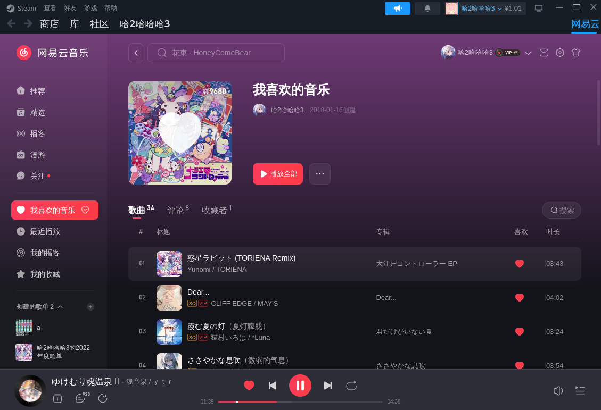
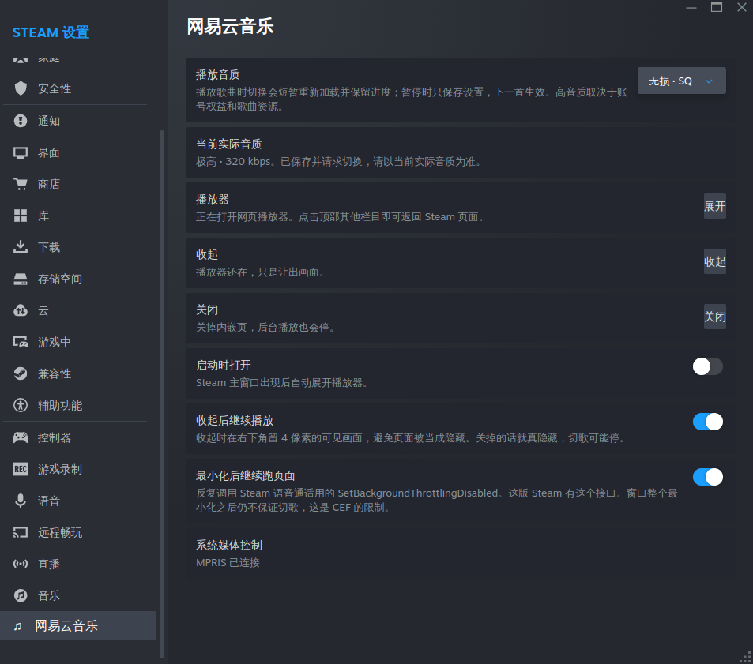
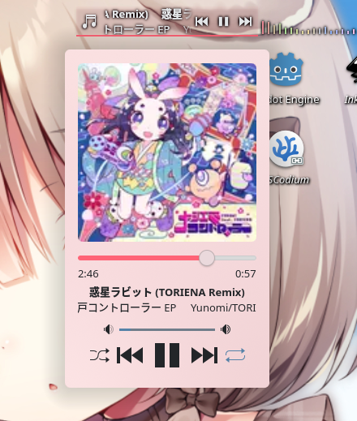

# NEMuxicOnSteam

这是一个 [Millennium](https://github.com/SteamClientHomebrew/Millennium) 插件，可以让你的Steam运行 网易云Web版

> 注意! 使用的是官网那个页面，不是重写的客户端：`https://music.163.com/st/webplayer`

把网易云官方网页播放器嵌进 **Steam**，就不用再挂一个浏览器和他们的客户端吃爆你内存了

这个项目还在胚胎阶段，先把框架搭起来再完善UI和使用体验这类，需要点时间

如果你愿意贡献代码可以提个 Issues 让我知道再提 PR

# 声明

- 不确保能一直使用，可能因为Steam更新、网易云音乐Web版下架、某个功能停用等不可预因素停止更新某个功能
- 非任何官方插件! 本项目与网易、Valve 都没关系。我要有关系我还在这写这个sb项目早躺平了
- 登录态在 Steam 自带的浏览器里，和系统其他浏览器不共享
- 不会窃取任何数据，程序就开源在这了，不放心就自己构建插件
- 不承担封号风险: 如果被封号建议去测丁磊老冯
- 本项目Ai生成: 这个项目是我指挥Ai写的并审查，反正这个项目也不大就内嵌个页面支持点小玩意啥的没啥技术含量。我不会typescript和lua，我臭玩rust和godotscript的（声明的声明：我虽然用Arch + rust但我不是那种xnnLGBT，我只是爱好者别给我扣帽子）

# 支持

> 由于Millennium仅支持x86_64版本的Steam，所以不支持arm。我也无能为力

| 系统    | 可用性                 | 备注及注意事项       |
| :---    | :---                   | :---                 |
| Linux   | 支持（主要推荐）       | 仅测试了Arch+KDE+Niri(DMS)，其他发行版或桌面环境不爆改应该都支持                       |
| Windows | 残废不推荐             | 本项目依赖MPRIS实现大部分功能，由于Windows没有MPRIS且我不用身边没有Windows设备测试，对于Win的支持完全不保证  |
| Mac OS  | 未测试适配             | 我是穷鬼安卓人没钱买苹果测试，但如您看上此项目且愿意长期帮忙测试我会很感谢             |
| FreeBSD | 未测试                 | Linux可以的话也许FreeBSD理论也可以                                                     |

# 特色功能

在Web版网易云的基础下添加更多的功能

详细介绍可看 [Wiki](https://github.com/TATyKeFei/NEMusicOnSteam/wiki/%E5%8A%9F%E8%83%BD%E4%BB%8B%E7%BB%8D) 中查看

| 支持功能   | 支持状况                                              | 备注   |
| :---       | :---                                                  | :---   |
| MPRIS      | 仅 Linux 支持                                                  | 仅Linux支持，Windows没有MPRIS不支持  |
| 通知       | 支持                                                  | 支持KDE原生通知、Mako等通知服务; Windows未测试        |
| 一起听     | 支持           | 可以加入/创建一起听房间。无法使用消息和麦克风语音聊天功能 |
| 音质设置   | 支持           | 在**Steam → 设置 → 网易云音乐**里可以设置。但要注意账号是否有vip不然开不了高音质 |
| 后台播放   | 支持           | 依赖Steam的通话api，如果你正在使用通话功能可能导致中断。不过应该没人边打电话边听歌吧?       |
| 下载歌曲   | 支持           | 列表里的歌曲更多菜单里新增了“下载”按钮，在**Steam → 设置 → 网易云音乐**里可以选下载音质和目录，默认路径 `~/Music/网易云音乐` |
| 听歌识曲   | 仅 Linux 支持  | 支持桌面音频、麦克风输入录制                     |
| 歌词       | 仅 Linux 支持  | 依赖 MPRIS 连接，做法见[#歌词](https://github.com/TATyKeFei/NEMusicOnSteam/wiki/%E5%8A%9F%E8%83%BD%E4%BB%8B%E7%BB%8D#%E6%AD%8C%E8%AF%8D)            |
| 全局快捷键 | 仅 Linux 支持  | 依赖 MPRIS 连接，做法见[#全局快捷键](https://github.com/TATyKeFei/NEMusicOnSteam/wiki/%E5%8A%9F%E8%83%BD%E4%BB%8B%E7%BB%8D#%E5%85%A8%E5%B1%80%E5%BF%AB%E6%8D%B7%E9%94%AE)       |
| 多播放引擎支持 | 仅 Linux 支持 | 可选 mpv、mpd 作为音频播放器引擎              |
| Steam叠加页面 | 正在尝试支持 | 仅支持X11的游戏/软件，因为sbSteam还不支持Wayland，使用Wayland的游戏打开叠加面板画面会卡死 |
| UnblockNeteaseMusic | 后续支持 | 解锁灰色无版权音乐                     |
| last.fm    | 后续支持       |  |
| API 接口   | 后续支持       | 其他插件可以使用api控制播放暂停歌曲       |

# 不支持功能

| 内容       | 支持状况                                              | 备注   |
| :--- | :--- | :--- |
| Steam好友状态显示当前播放歌曲 | 不支持   | 目前没有稳定良好的思路方法实现，也怕有坏人用来骚扰好友         |

# 预览

<p align="center">
  
  <br>
  <sub>主界面(暂时通过右上角入口进入，以后可能会改)</sub>
</p>

<p align="center">
  
  <br>
  <sub>设置界面(施工中，图片里全是工地)</sub>
</p>

<p align="center">
  
  <br>
  <sub>MPRIS支持; 此图片的部件为<a herf=https://github.com/ccatterina/plasmusic-toolbar>PlsaMusic Toolbar</a></sub>
</p>

<p align="center">
  
  <br>
  <sub>切换、下一首歌曲弹窗通知支持</sub>
</p>

# 怎么用?

装好并启用之后，「库」「社区」导航行的右侧有一个 **网易云** 文字，点击即可打开

设置里可以开「启动时打开」。默认不开，避免一启动 Steam 就被播放器盖住

播放器展开时，如果 Steam 自己打开了网页（商店、社区、新闻这类），播放器会自己收起到右下角把画面让开，音乐照常播；你从那个页面退出来，播放器就回来，也可以点顶栏的「网易云」手动叫回来

第一次打开会让你扫码登录一下，之后都不会弹登录了

在 **Steam → 设置 → 网易云音乐 → 播放后端** 中可以选择「内嵌网页播放器」或「mpv（外部音频）」。使用 mpv 前需要先安装 `mpv`；网页仍负责登录、选歌、歌单和一起听，mpv 负责实际音频输出。当前 mpv 后端仅支持 Linux。

# 安装教程

详细介绍可看 [Wiki](https://github.com/TATyKeFei/NEMusicOnSteam/wiki/%E5%AE%89%E8%A3%85%E6%95%99%E7%A8%8B)

# 构建

> 需要 Nodejs 22及以上 版本

```bash
npm install
npm test
npm run build      # 测试开发时: npm run dev 
```

构建产物在 `dist/<插件 id>-<版本号>.star`，例如 `dist/icu.tatyrealms.nemos-0.1.0.star`，版本号取自 `millennium.toml` 的 `[plugin].version`

```安装
cp ./dist/icu.tatyrealms.nemos-0.1.0.star ~/.local/share/millennium/plugins/
```

不建议把 `millennium.toml` 里的 `output_path` 改成 `auto` 构建

由于使用了[脚本](scripts/build.mjs)自动添加版本号后缀，为 auto 时 Millennium 会重启 Steam 热重载棍母插件浪费时间

# 项目结构

```
├── NEMusicOnSteam/
│   ├── .docs/                     # 项目文档与预览素材
│   ├── backend/                   # 后端 (Lua + Python)
│   │   └── ...   # 等确定下来再写
│   ├── frontend/                  # 前端 (TypeScript/React)
│   │   └── ...   # 等确定下来再写
│   ├── .gitignore                 # Git 忽略配置
│   ├── .luarc.json                # Lua 语言服务器配置
│   ├── LICENSE                    # 开源许可证 (GPLv3)
│   ├── README.md                  # 项目说明与使用指南
│   ├── millennium.toml            # Millennium 插件配置文件
│   ├── package-lock.json          # 依赖版本锁定文件
│   ├── package.json               # 项目依赖与脚本配置
│   └── tsconfig.json              # TypeScript 编译配置
```

# 已知限制

- 插件创建 BrowserView 时关了 `bOnlyAllowTrustedPopups`，否则 Steam 打开网易云等第三方网站会弹允许非信任弹窗
- 播放器页面使用 Steam 的 BrowserView 承载网页；Steam 本身没有供插件注册独立主窗口路由的稳定接口
- Steam 更新可能改掉 `BrowserView` 或主窗口名字 `SP Desktop`可能导致打不开，需要时间适配
- MPRIS 通过 DevTools 在网易云页面读取状态并调用现有播放器动作，依赖网页的 React/Redux 结构；网易云音乐Web版改版可能需要时间更新适配
- mpv 后端依赖本机安装 `mpv`，启动时会避开 Steam Runtime 的动态库环境；目前由网易云网页提供歌曲地址和播放列表，网页登录失效或网易云改版时，mpv 也无法继续解析新歌曲
- 后台播放依赖 Steam 的通话功能，会调用`SteamClient.Browser.SetBackgroundThrottlingDisabled(true)`函数。如果你正在通话时暂停播放音乐可能导致通话出问题
- 检测「Steam 有没有打开自己的网页」靠的是网页容器的类名，Steam 大更新后类名会变，判断可能失效。失效时 Steam 的网页会盖住播放器，手动点「收起」一样能看

# 使用/参考的项目

本仓库使用了以下项目的代码、参考了他们的实现思路

非常感谢以下项目，没有他们我要摸打滚爬好久才能做出来，开源万岁!

| 项目 | 链接 | 备注 |
| :--- | :--- | :--- |
| Millennium | [Github仓库](https://github.com/SteamClientHomebrew/Millennium)  | 用于加载本插件                                      |
| MusicFox   | [Github仓库](https://github.com/go-musicfox/go-musicfox)         | 好用的网易云终端工具，本项目的MPIRS功能参考了此项目 |
| open orpheus | [Github仓库](https://github.com/YUCLing/open-orpheus)          | 能让Linux运行网易云客户端，听歌识曲功能参考了此项目 |
| NeteaseCloudMusicApiEnhanced | [Github仓库](https://github.com/NeteaseCloudMusicApiEnhanced/api-enhanced) | 听歌识曲api接口功能用了他 |
| Qplayer    | [Github仓库](https://github.com/TIMER-err/qplayer)               | 第三方网易云音乐客户端，一起听功能参考了他          |

# 为什么有网易云客户端还要去写这个？

如果你去网易云音乐官网下载页面点击Linux下载，你会发现tm居然直接跳转到Web版？

那么多个客户端版本就是不给Linux适配，我天天用Muxicfox按错快捷键没有都不知道有点烦

然后我看到我Steam天天在后台没啥用，想到他能装插件于是就萌生了这种想法让Linux用上网易云

结果搭配 MPRIS 我体验下来确实不错，没想到Web版音质也这么好

反正Stean天天在后台吃内存也是吃白饭，不用白不用。哦对了v社啥时候才支持wayland，2027年了哥
