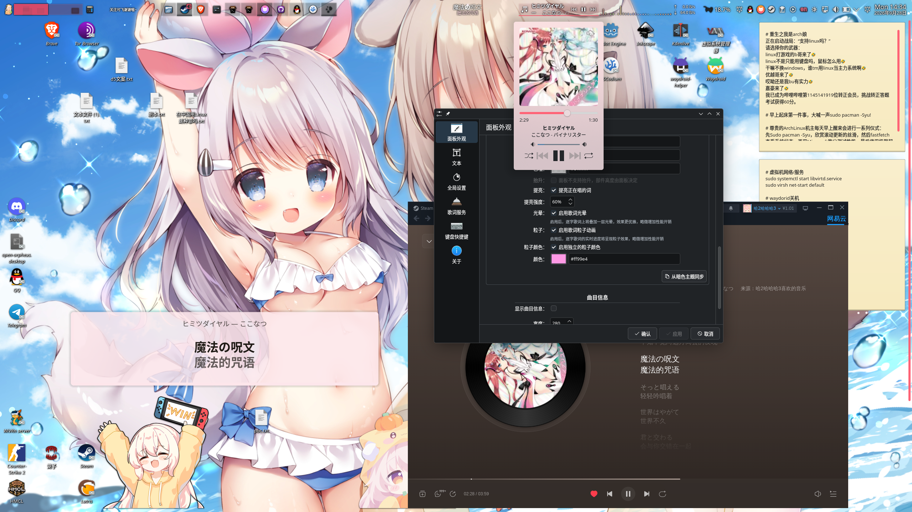
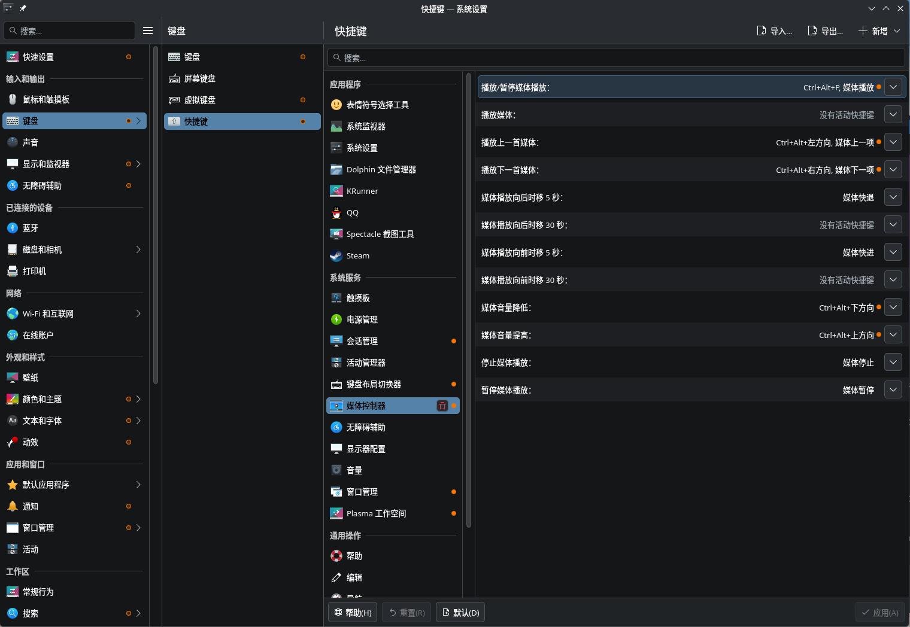

# NEMuxicOnSteam

这是一个 [Millennium](https://github.com/SteamClientHomebrew/Millennium) 插件，可以让你的Steam运行`网易云Web版`

> 注意! 使用的是官网那个页面，不是重写的客户端：`https://music.163.com/st/webplayer`

把网易云官方网页播放器嵌进 **Steam**，就不用再挂一个浏览器和他们的客户端吃爆你内存了

这个项目还在胚胎阶段，先把框架搭起来再完善UI和使用体验这类，需要点时间

如果你愿意贡献代码可以提个 Issues 让我知道再提 PR

# 声明

- 不确保能一直使用，可能因为Steam更新、网易云音乐Web版下架等不可预因素停止更新某个功能
- 非任何官方插件! 本项目与网易、Valve 都没关系。我要有关系我还在这写这个sb项目早躺平了
- 登录态在 Steam 自带的浏览器里，和系统其他浏览器不共享
- 不会窃取任何数据，程序就开源在这了，不放心就自己构建插件
- 本项目Ai生成: 这个项目是我指挥Ai写的并审查，反正这个项目也不大就内嵌个页面支持点小玩意啥的没啥技术含量。我不会typescript和lua，我臭玩rust和godotscript的
- 我不是xnn

# 支持

> 由于Millennium仅支持x86_64版本的Steam，所以不支持arm。我也无能为力

| 系统    | 可用性                 | 备注及注意事项       |
| :---    | :---                   | :---                 |
| Linux   | 支持                   | 仅测试了Arch+KDE+Niri(DMS)，其他发行版或桌面环境不爆改应该都支持                       |
| Windows | 残废，只能听歌         | 本项目依赖MPRIS实现大部分功能，由于Windows没有MPRIS且我不用Windows，对于Win的支持完全不保证。如果你有需求且愿意维护测试可以自己fork一份  |
| FreeBSD | 未测试                 | Linux可以的话也许FreeBSD理论也可以                                                     |
| Mac OS  | 不支持                 | 我是穷鬼安卓人没钱买苹果测试，不过Millennium好像也没支持MacOS                          |

# 特色功能

在Web版网易云的基础下添加更多的功能

| 内容       | 支持状况                                              | 备注   |
| :---       | :---                                                  | :---   |
| MPRIS      | 支持媒体键、控制音量进度条; 循环、列表播放还未支持    | 仅Linux支持  |
| 通知       | 支持发送系统通知显示歌曲信息、封面                    | Mako、Windows未测试，仅测试了KDE通知        |
| 音质设置   | 支持           | 在**Steam → 设置 → 网易云音乐**里可以设置。但要注意账号是否有vip不然开不了高音质 |
| 后台播放   | 支持  | 依赖Steam的通话api，如果你正在使用通话功能可能导致中断。不过应该没人边打电话边听歌吧?       |
| 下载歌曲   | 支持           | 列表里的歌曲更多菜单里新增了“下载”按钮，在**Steam → 设置 → 网易云音乐**里可以选下载音质和目录，默认路径 `~/Music/网易云音乐` |
| 听歌识曲   | 仅 Linux 支持  | 支持桌面音频、麦克风输入录制                     |
| 歌词       | 仅 Linux 支持  | 依赖 MPRIS 连接，做法见[#歌词](#歌词)       |
| 全局快捷键 | 仅 Linux 支持  | 依赖 MPRIS 连接，做法见[#全局快捷键](#全局快捷键)       |
| Steam叠加页面 | 正在尝试支持 | 仅支持X11的游戏/软件，因为Steam还tm不支持Wayland，使用Wayland的游戏打开叠加面板画面会卡死 |
| API 接口   | 后续支持       |        |

# 不支持功能

| 内容       | 支持状况                                              | 备注   |
| :--- | :--- | :--- |
| 状态显示当前歌曲 | 不支持   | 目前没有稳定良好的思路方法实现，而且会骚扰好友   |

## 听歌识曲

在顶部“网易云音乐”的悬浮菜单中点击“听歌识曲”，或使用 **Steam → 设置 → 网易云音乐 → 听歌识曲**。选择“系统声音”可以识别游戏、视频等默认输出设备正在播放的音乐；选择“麦克风”则使用系统默认输入设备。点击开始后采集约 6 秒，支持取消，识别结果可以打开网易云歌曲页面。

需要运行中的 PulseAudio 或 PipeWire 的 PulseAudio 兼容服务，以及 `parec`（Debian/Ubuntu 的 `pulseaudio-utils`、Arch 的 `libpulse`）；也可使用支持 PulseAudio 输入的 `ffmpeg`。设备选择跟随系统默认输入／输出，使用系统声音时建议暂停网易云自身播放，避免混音影响识别。

首次使用会从 GitHub 下载固定版本且校验 SHA-256 的音频指纹引擎，缓存在辅助进程内存中；需要能够访问 `raw.githubusercontent.com` 和网易云识曲接口。实现参考 [NeteaseCloudMusicApiEnhanced 的 audio_match_demo](https://github.com/NeteaseCloudMusicApiEnhanced/api-enhanced/tree/a8c781fd64faab17fedfd46e0615a2609307f163/public/audio_match_demo)。录音仅在本机内存中处理，不写录音文件；只向网易云发送音频指纹。识别成功率和可用性取决于音源及网易云接口，不保证哼唱识别。

# 预览

<p align="center">
  
  <br>
  <sub>主界面(暂时通过右上角入口进入，以后可能会改)</sub>
</p>

<p align="center">
  
  <br>
  <sub>设置界面(施工中，图片里全是工地)</sub>
</p>

<p align="center">
  
  <br>
  <sub>MPRIS支持; 此图片的部件为<a herf=https://github.com/ccatterina/plasmusic-toolbar>PlsaMusic Toolbar</a></sub>
</p>

<p align="center">
  
  <br>
  <sub>切换、下一首歌曲弹窗通知支持</sub>
</p>

# 安装教程

## 需求

- 需要 [Millennium](https://github.com/SteamClientHomebrew/Millennium) **3.4.0+**
- 不支持通过 Flatpak / Snap / Linyaps 等第三方包管理器安装的 Steam (本来也不建议通过第三方包管理器安装Steam)

### Arch系发行版

#### 通过Pacman安装(推荐)

如果配置过archlinuxcn仓库，Millennium在archlinuxcn上有，你可以从archlinuxcn仓库安装

没配置过archlinuxcn仓库的人也强烈建议去弄下老好用了

```
sudo pacman -S millennium
```

#### 通过Aur安装

没配置过archlinuxcn可以通过Aur安装

```
paru: `paru -S millennium`
yay:  `yay -S millennium`
```

#### 可选安装

如需要媒体键控制需要额外依赖

MPIRS依赖Python3、PyGObject和D-Bus，可通过安装以下包解决

```
sudo pacman -S python-gobject
```

### Windows

不知道，好像是通过exe安装包安装的。可以看看Millennium官网

https://docs.steambrew.app/users/getting-started/installation

### 其他Linux发行版/系统

复制下面命令下载其他发行版的预编译脚本并执行，官方推荐的我没试过，装之前建议自己先看一遍

```bash
curl -fsSL "https://steambrew.app/install.sh" | bash
```

## 开始安装插件

从[Releases](https://github.com/TATyKeFei/NEMusicOnSteam/releases)页面下载最新版插件，放入这个路径里

Linux: `~/.local/share/millennium/plugins/`

Windows: `不知道`

然后完全终止 Steam 进程再打开，在 **Steam → Millennium → Plugins**里可以配置启用/禁用（默认已经是启用了）

# 怎么用?

装好并启用之后，「库」「社区」那一行的右侧有一个 **网易云** 文字，点击即可打开

设置里可以开「启动时打开」。默认不开，避免一启动 Steam 就被播放器盖住

播放器展开时，如果 Steam 自己打开了网页（商店、社区、新闻这类），播放器会自己收起到右下角把画面让开，音乐照常播；你从那个页面退出来，播放器就回来，也可以点顶栏的「网易云」手动叫回来

第一次打开会让你扫码登录一下，之后都不会弹登录了

# 功能介绍

## 后台播放

Steam 语音通话会调用`SteamClient.Browser.SetBackgroundThrottlingDisabled(true)`

但关闭播放器时会把那个节流开关调回去。这时候如果正在语音，有可能和通话抢同一个开关

插件在播放器还活着的时候，每隔几秒把同一个开关打开。这是为了 Steam 窗口最小化之后，页面里的定时器和切歌逻辑还能跑。

这是对照当前 Steam 的 `steamui` 写的，**还没有在最小化状态下实际听完一首再切歌的验证**。如果最小化之后声音还在、但播完不切下一首，多半是网页自己暂停了，或者 CEF 没理会这个接口。插件解决不了那种情况。收起时如果连那 4 像素也关掉，切歌更容易停。

## MPRIS

> 需要 Python3、PyGObject和D-Bus

Arch系可以安装这个解决`sudo pacman -S python-gobject`、Debian系安装`python3-gi`、Windows不知道

MPRIS 使用 Millennium 的 Chrome DevTools 接口读取内嵌网页，再由随插件打包的 Python 辅助进程在用户会话 D-Bus 上注册 `org.mpris.MediaPlayer2.NEMusicOnSteam`。打开 Steam 后可用 `playerctl -l` 查看；关闭 Steam 或卸载插件后，辅助进程会在约 15 秒内自行退出。网页改版可能使歌曲信息或上一首、下一首按钮失效

播放一首歌后可以用 `playerctl -p NEMusicOnSteam metadata` 查看信息，或用 `playerctl -p NEMusicOnSteam play-pause` 测试控制。插件设置页会显示 MPRIS 连接状态

Linux 上首次开始播放或切换歌曲后开始播放时，会发送系统桌面通知：标题为当前歌名，正文为歌手，图标优先显示歌曲封面。封面在后台加载并临时缓存，加载失败时使用默认音乐图标。同一首歌暂停后继续播放、持续播放、调整进度和音量不会重复通知；通知遵循桌面系统的勿扰设置，默认显示约 5 秒

进度跳转和音量控制通过网页现有的 Redux 播放器动作执行，音量读取播放器确认后的状态，关闭音量浮层也能操作。可以用 `playerctl -p NEMusicOnSteam position 60` 跳到第 60 秒，用 `playerctl -p NEMusicOnSteam volume 0.3` 调到 30%，再用 `playerctl -p NEMusicOnSteam volume` 查看回报。如果网页改版后无法找到播放器状态，插件设置页和 Steam 控制台会报告命令未执行

## 歌词

依赖 MPRIS 且仅 Linux，可以使用支持 MPRIS 的工具例如KDE小部件或其他软件

<p align="center">
  
  <br>
  <sub>MPRIS 歌词支持，顶部栏中间和桌面上的那个<br>此处演示使用部件为 <a href="https://github.com/swim233/plasma-lyrics">Plasma Lyrics</a></sub>
</p>

### 限制

- 在播放器页面内直接向网易云接口取歌词，原文和翻译按时间戳合并成纯文本（不带时间戳）
- 通过标准 MPRIS 元数据通过 xesam:asText 暴露
- 为避免元数据过大卡顿最多只同步 32KB
- 没有歌词的歌（纯音乐、播客之类）只会请求一次，不会反复请求；接口取不到时回退为读取页面上显示的歌词
- 逐字高亮（卡拉OK）和罗马音传不出去，MPRIS 的歌词只有 asText 一个纯文本字段。但也不必太伤心，有支持逐字高亮的比如这个 KDE 小部件 [Plasma Lyrics](https://github.com/swim233/plasma-lyrics)，支持的歌可以显示逐字高亮

可能有些 MPRIS 客户端不显示 xesam:asText，播放器或桌面工具需要支持该字段

如果不支持也最好换一个或叫作者支持

## 全局快捷键

依赖 MPRIS 且仅 Linux，插件不自己抢键盘（Wayland 本来也不允许），利用了 MPIRS + 媒体控制器

<p align="center">
  
  <br>
  <sub>在KDE设置→快捷键→媒体控制器中可以设置<br>除了"向后播放xx秒"其他媒体键全正常使用</sub>
</p>

### 其他方式

| 桌面 | 在哪绑 |
| :--- | :--- |
| KDE | 系统设置 → 键盘 → 快捷键 → 添加 → 媒体控制器 |
| Niri | `bind "Mod+Alt+P" { spawn "playerctl" "-p" "NEMusicOnSteam" "play-pause"; }` 此处使用 playerctl 演示 |
| GNOME | 设置 → 键盘 → 查看及自定义快捷键 → 自定义快捷键 |
| Xfce | 设置 → 键盘 → 应用程序快捷键 |
| Cinnamon / MATE / LXQt | 各自的键盘设置里都有自定义快捷键 |
| Sway | `bindsym --release Ctrl+Alt+p exec playerctl -p NEMusicOnSteam play-pause` |
| Hyprland | `bind = CTRL ALT, P, exec, playerctl -p NEMusicOnSteam play-pause` |

> 网上搜的问ai答的不一定准确，我只用过 KDE Niri 其他不知道

#### 如您有其他需求或使用的桌面环境没有类似功能可以自己弄命令快捷键

> 需要 MPIRS 客户端，推荐 playerctl
>
> sudo pacman -S playerctl

| 用途 | 命令 |
| :--- | :--- |
| 暂停 / 继续 | `playerctl -p NEMusicOnSteam play-pause` |
| 下一首 | `playerctl -p NEMusicOnSteam next` |
| 上一首 | `playerctl -p NEMusicOnSteam previous` |


键盘上那些多媒体键（播放/暂停/上一首/下一首）多数桌面会自动接管 MPRIS 客户端，通常不用自己绑；只有自定义组合键才需要上面这套。

不想装 `playerctl` 也能用，直接走 D-Bus 一样，就是把 `PlayPause` 换成 `Next`、`Previous`：

```bash
dbus-send --session --dest=org.mpris.MediaPlayer2.NEMusicOnSteam --type=method_call \
  /org/mpris/MediaPlayer2 org.mpris.MediaPlayer2.Player.PlayPause
```

Steam 没开着的时候按了没反应是正常的，辅助进程跟着 Steam 一起退出

# 构建

```bash
npm install
npm test
npm run build      # 测试开发时: npm run dev 
```

构建产物在 `dist/<插件 id>-<版本号>.star`，例如 `dist/icu.tatyrealms.nemos-0.1.0.star`，版本号取自 `millennium.toml` 的 `[plugin].version`

```安装
cp ./dist/icu.tatyrealms.nemos-0.1.0.star ~/.local/share/millennium/plugins/
```

不建议把 `millennium.toml` 里的 `output_path` 改成 `auto` 构建

由于使用了[脚本](scripts/build.mjs)自动添加版本号后缀，为 auto 时 Millennium 会重启 Steam 热重载棍母插件浪费时间

# 项目结构

```
├── NEMusicOnSteam/
│   ├── .docs/                     # 项目文档与预览素材
│   ├── backend/                   # 后端 (Lua + Python)
│   │   └── ...   # 等确定下来再写
│   ├── frontend/                  # 前端 (TypeScript/React)
│   │   └── ...   # 等确定下来再写
│   ├── .gitignore                 # Git 忽略配置
│   ├── .luarc.json                # Lua 语言服务器配置
│   ├── LICENSE                    # 开源许可证 (GPLv3)
│   ├── README.md                  # 项目说明与使用指南
│   ├── millennium.toml            # Millennium 插件配置文件
│   ├── package-lock.json          # 依赖版本锁定文件
│   ├── package.json               # 项目依赖与脚本配置
│   └── tsconfig.json              # TypeScript 编译配置
```

# 已知限制

- 插件创建 BrowserView 时关了 `bOnlyAllowTrustedPopups`，否则 Steam 打开网易云等第三方网站会弹允许非信任弹窗
- 播放器页面使用 Steam 的 BrowserView 承载网页；Steam 本身没有供插件注册独立主窗口路由的稳定接口
- Steam 更新可能改掉 `BrowserView` 或主窗口名字 `SP Desktop`可能导致打不开，需要时间适配
- MPRIS 通过 DevTools 在网易云页面读取状态并调用现有播放器动作，依赖网页的 React/Redux 结构；网易云音乐Web版改版可能需要时间更新适配
- 后台播放依赖 Steam 的通话功能，会调用`SteamClient.Browser.SetBackgroundThrottlingDisabled(true)`函数。如果你正在通话时暂停播放音乐可能导致通话出问题
- 检测「Steam 有没有打开自己的网页」靠的是网页容器的类名，Steam 大更新后类名会变，判断可能失效。失效时 Steam 的网页会盖住播放器，手动点「收起」一样能看

# 使用/参考的项目

本仓库使用了以下项目的代码、参考了他们的实现思路

非常感谢以下项目，没有他们我要摸打滚爬好久才能做出来，开源万岁!

| 项目 | 链接 | 备注 |
| :--- | :--- | :--- |
| Millennium | [Github仓库](https://github.com/SteamClientHomebrew/Millennium)  | 用于加载本插件                                      |
| MusicFox   | [Github仓库](https://github.com/go-musicfox/go-musicfox)         | 好用的网易云终端工具，本项目的MPIRS功能参考了此项目 |
| open orpheus | [Github仓库](https://github.com/YUCLing/open-orpheus)          | 能让Linux运行网易云客户端，听歌识曲功能参考了此项目 |

# 为什么有网易云客户端还要去写这个？

如果你去网易云音乐官网下载页面点击Linux下载，你会发现tm居然直接跳转到Web版？

那么多个客户端版本就是不给Linux适配，我天天用Muxicfox按错快捷键有点烦

然后我看到我Steam天天在后台没啥用，想到他能装插件于是就萌生了这种想法让Linux用上网易云

反正Stean天天在后台吃内存也是吃白饭，不用白不用。哦对了v社啥时候才支持wayland，2027年了哥

结果我体验下来确实不错，没想到Web版音质也这么好